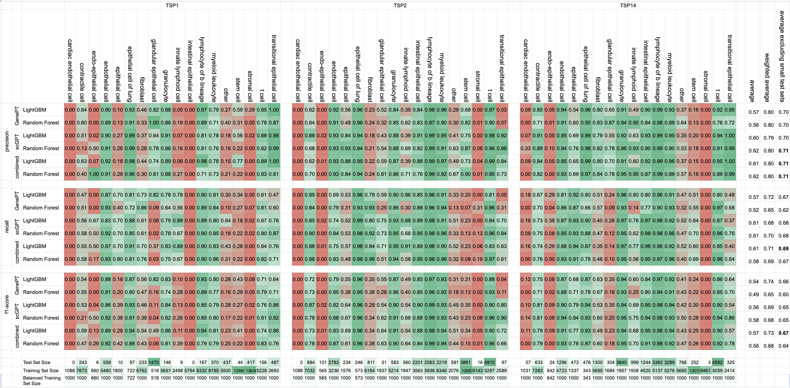

# GenePT-tools

Tools to use and expand the capabilities of the original GenePT. This repository contains utilities and notebooks for working with gene embeddings and single-cell RNA sequencing data.

## Overview

This project builds upon the GenePT paper and provides tools to:
- Compare different embedding approaches (GenePT vs scGPT)
- Work with large single-cell datasets like Tabula Sapiens
- Generate composable embeddings across different dimensions
- Perform cell type classification using embeddings

### Results

The following image shows a detailed summary of the results of the comparison between GenePT and scGPT zero-shot classification so far:

We used a [Google Sheet](https://docs.google.com/spreadsheets/d/1Epjhj0ZBFEdY5iIONLi9-I8geACofHlaFGvKu561I5U/edit?usp=sharing) to format the output


## Setup

See [SETUP_GUIDE.md](SETUP_GUIDE.md) for more detail on getting up and running.

### Requirements
- Python 3.10 (required for scGPT compatibility)
- Standard scientific Python packages (pandas, numpy, scikit-learn)
- Special dependencies:
  - scGPT
  - AnnData
  - Hugging Face datasets/models

### Installation
We use `uv` for package management.  Install using the instructions at https://docs.astral.sh/uv/getting-started/installation/ 

Then:

```bash
uv sync
uv pip install -e '.[dev]' # to use testing tools etc
```

### Running tools
```bash
# Format code
scripts/format.sh
uv run isort --gitignore .

# run tests
uv run pytest
```

### Training the CellXGene MLP Model

The `scripts/train_cellxgene_mlp.py` script trains an MLP classifier on CellXGene embeddings for cell type classification.

#### Basic Usage
```bash
# Train with local data
python scripts/train_cellxgene_mlp.py \
  --local-data-dir data/cellxgene_embeddings/training_v1_shuffled \
  --test-data-dir data/cellxgene_embeddings/test_v1 \
  --cell-types-file cell_types_filtered.csv \
  --epochs 2 \
  --device cuda \
  --wandb-project cellxgene-mlp

# Stream directly from S3 (requires AWS credentials)
python scripts/train_cellxgene_mlp.py \
  --s3-bucket pythiomicsdata \
  --s3-prefix cellxgene_v2/training_v1_shuffled \
  --test-data-dir data/cellxgene_embeddings/test_v1 \
  --download-if-missing \
  --epochs 10 \
  --device cuda

# Resume from checkpoint
python scripts/train_cellxgene_mlp.py \
  --resume-from checkpoints/checkpoint_epoch5_batch1000.pt \
  --local-data-dir data/cellxgene_embeddings/training_v1_shuffled \
  --test-data-dir data/cellxgene_embeddings/test_v1
```

#### Key Parameters
- `--local-data-dir`: Directory with pre-shuffled training parquet files
- `--test-data-dir`: Directory with validation data
- `--cell-types-file`: CSV file mapping cell type names to codes (optional)
- `--epochs`: Number of training epochs (default: 10)
- `--batch-size`: Batch size for training (default: 1024)
- `--learning-rate`: Learning rate for AdamW optimizer (default: 4.366e-05)
- `--checkpoint-dir`: Where to save model checkpoints (default: checkpoints/)
- `--wandb-project`: Weights & Biases project for experiment tracking

For full parameter documentation, run:
```bash
python scripts/train_cellxgene_mlp.py --help
```

## Important files
```
GenePT-tools/
├── src/        # utility functions
└── notebooks/  # analysis notebooks
```
### Notebooks

Take a look at `generate_genept_embeddings.ipynb` to see how to generate a GenePT embeddings and dataset and upload them to HuggingFace Hub.  `create_hf_repos.ipynb` will create a new repository for the embeddings and dataset.

Take a look at `tabula_sapiens_*.ipynb` for a comparison of cell type classification using GenePT and scGPT embeddings.

| Notebook                                                                                                   | Description                                                                       |
|------------------------------------------------------------------------------------------------------------|-----------------------------------------------------------------------------------|
| [`generate_genept_embeddings.ipynb`](notebooks/generate_genept_embeddings.ipynb)                           | Generates the GenePT embeddings and dataset for upload to HuggingFace Hub         |
| [`tabula_sapiens_embed_genept.ipynb`](notebooks/tabula_sapiens_embed_genept.ipynb)                         | Evaluates GenePT embeddings' cell classification performance on Tabula Sapiens    |
| [`create_hf_repos.ipynb`](notebooks/create_hf_repos.ipynb)                                                 | Creates the initial HuggingFace repositories for the GenePT embeddings and dataset|
| [`tabula_sapiens_eda.ipynb`](notebooks/tabula_sapiens_eda.ipynb)                                           | Exploratory analysis of the Tabula Sapiens single-cell dataset                    |
| [`tabula_sapiens_embed_genept.ipynb`](notebooks/tabula_sapiens_embed_genene.ipynb)                         | Embed a subset of the Tabula Sapiens dataset using GenePT embeddings              |
| [`tabula_sapiens_embed_scgpt.ipynb`](notebooks/tabula_sapiens_embed_scgpt.ipynb)                           | Embed a subset of the Tabula Sapiens dataset using scGPT embeddings               |
| [`tabula_sapiens_analysis_all.ipynb`](notebooks/tabula_sapiens_analysis_all.ipynb)                         | A comparison of GenePT and scGPT embeddings for cell type classification on TS    |

### Data Processing
- Support for loading and processing large sparse AnnData files
- Integration with Hugging Face datasets

### Embedding Generation
- GenePT original embeddings
- scGPT embeddings
- Composable embeddings across different dimensions:
  - Associated genes
  - Aging related information
  - Drug interactions
  - Pathways and biological processes

### Analysis Tools
- Cell type classification
- Embedding comparison utilities
- Visualization tools for high-dimensional data

## Project Status

- [x] Exact comparison between scGPT and GenePT embeddings
- [x] Minimum cell count filtering per cell type
- [x] AnnData integration
- [x] Original GenePT embeddings support
- [ ] Prompt improvements
  - [x] Remove aging
  - [x] Add cell type
  - [ ] Add tissue type
  - [ ] Add dysfunctional cell type
- [ ] scGPT with batch tokens
- [ ] scGPT with modality tokens
- [ ] scGPT with combined batch/modality tokens
- [ ] Complete Tabula Sapiens cell embedding
- [ ] Cell-document bidirectional lookups
- [ ] Cell separation analysis
  
## Contributing

This is a preliminary repository with work in progress. Code is mostly untested but being actively developed. Contributions and collaborations are welcome.

## License

This project is subject to the x   described in the LICENSE.md file.
